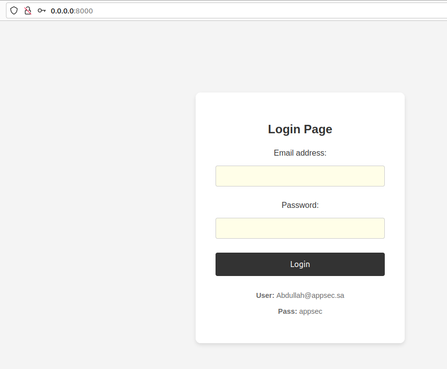
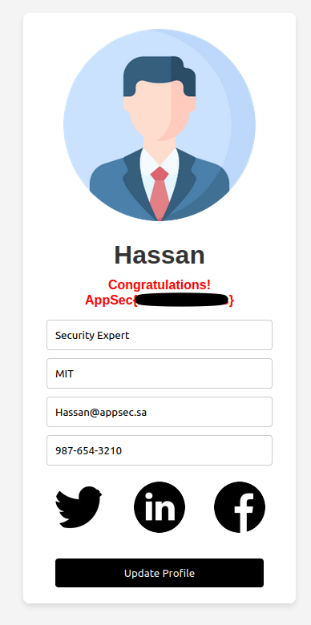

# Challenge : Broken Access Control

To start the Broken Access Control challenge, run the following command:

```bash
docker run -p 8000:80 appsechala/broken-access
```
This will start the challenge on your local machine and make it accessible via `http://localhost:8000`or `http://0.0.0.0:8000`

## Page

After login firest time and logout :

```bash
User: Abdullah@appsec.sa

Pass: appsec
```



## Flag


