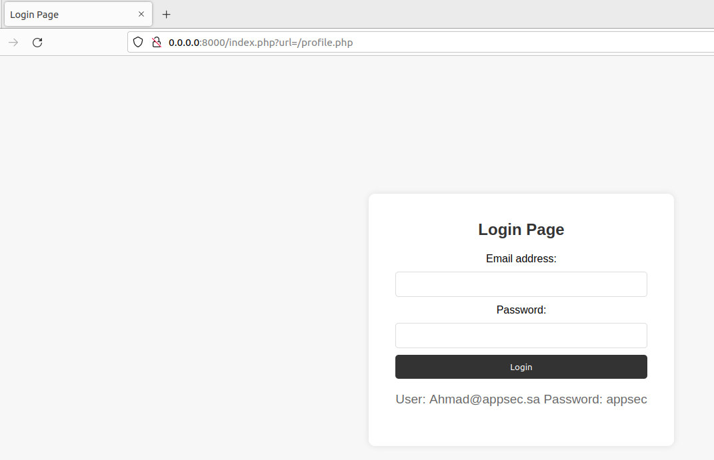
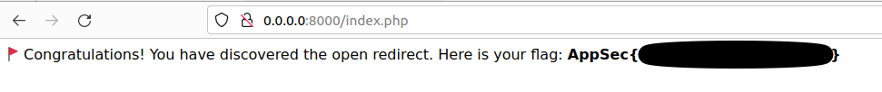

# Challenge 1: Open Redirect

To start the Open Redirect challenge, run the following command:

```bash
docker run -p 8000:80 appsechala/open-redirect
```
This will start the challenge on your local machine and make it accessible via `http://localhost:8000`or `http://0.0.0.0:8000`

## Page

After login firest time and logout :

```bash
User: Ahmad@appsec.sa 
Password: appsec
```


## Flag



